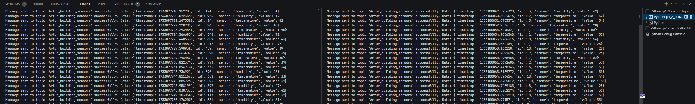
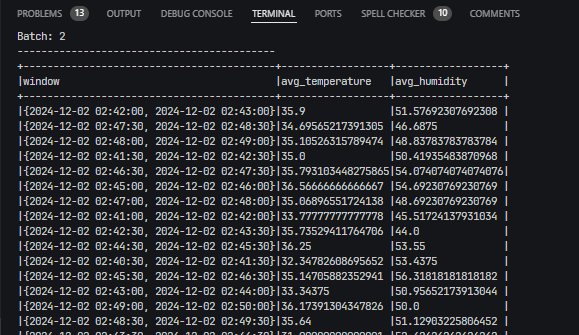
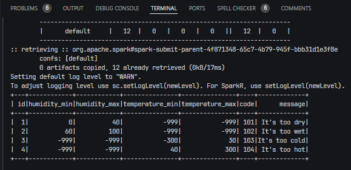
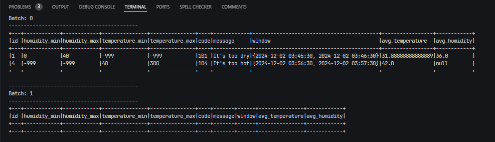
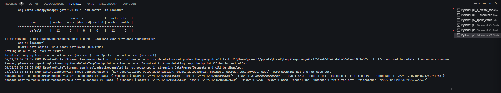

# goit-de-hw-06.

## 1. Генерація потоку даних:

Вхідні дані — це дані з Kafka-топіку, такі самі, як і в попередньому домашньому завданні. Згенеруйте потік даних, що містить `id`, `temperature` , `humidity`, `timestamp` . Можна використати раніше написаний вами скрипт та топік.

### Рішення

- створення топіків: [p1_1_create_topic.py](p1_1_create_topic.py)
- генерація потоку даних: [p1_2_producer.py](p1_2_producer.py)

## 2. Агрегація даних:

Зчитайте потік даних, що ви згенерували в першому пункті. За допомогою _Sliding window_, що має довжину 1 хвилину, _sliding_interval_ — 30 секунд, та _watermark duration_ — 10 секунд, знайдіть середню температуру та вологість.

### Рішення

- агрегація даних: [p2.py](p2.py)
- скрин генерації даних сенсорів та відправки даних в building_sensors з демонстрацією двох (або більше) одночасних роботи двох запусків програми;  
  
- скрин агрегації і знаходження середнього;  
  

## 3. Знайомство з параметрами алертів:

Щоб деплоїти код кожного разу, параметри алертів вказані в файлі:
[alerts_conditions.csv](alerts_conditions.csv)
Файл містить максимальні та мінімальні значення для температури й вологості, повідомлення та код алерту. Значення -999,-999 вказують, що вони не використовується для цього алерту.
Необхідно зчитати дані з файлу та використати для налаштування алертів.

### Рішення

- зчитування даних з файлу [p3.py](p3.py)  
  

## 4. Побудова визначення алертів:

Після того, як ви знайшли середні значення, необхідно встановити, чи підпадають вони під критерії у файлі (підказка: виконайте cross join та фільтрацію).

### Рішення

- об'єднання і фільтрація: [p4.py](p4.py)
- скрин відфільтрованих алертів: 

## 5. Запис даних у Kafka-топік:

Отримані алерти запишіть у вихідний Kafka-топік.
Приклад повідомлення в Kafka, що є результатом роботи цього коду:

```JSON
{
  "window": {
    "start": "2024-08-18T16:08:00.000+03:00",
    "end": "2024-08-18T16:09:00.000+03:00"
  },
  "t_avg": 56.61538461538461,
  "h_avg": 58.07692307692308,
  "code": "104",
  "message": "It's too hot",
  "timestamp": "2024-08-18 16:05:50.907777"
}
```

### Рішення

- запис даних у Kafka-топік: [p5.py](p5.py)
- скрин: 
